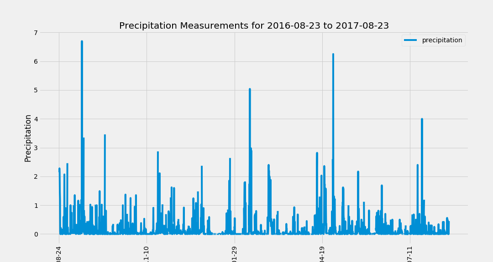
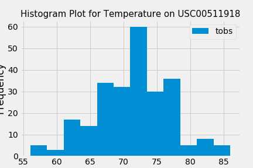

# SQLalchemy-Challenge
Python and SQLAlchemy script to analyze climate data from the hawaii.sqlite database.

Python and SQLAlchemy were used to perform a basic climate analysis and data exploration of the climate database. All of the analysis was completed using SQLAlchemy ORM queries, Pandas, and Matplotlib.

* SQLAlchemy was used to create_engine and connect to the sqlite database.
* SQLAlchemy automap_base() was used to reflect the tables into classes and saved to classes called Station and Measurement.

### Precipitation Analysis

* A query was created to retrieve the last 12 months of precipitation data.
* Query results were loaded into a Pandas DataFrame and the index was set as column.
* Results were ploted using the DataFrame plot method.

### Station Analysis

* A query was created to calculate the total number of stations and most active stations. Data was sorted in descending order.
* The Min, Max, Count and Avg functions were used to calculate the observations.
* A query was also created to retrieve the last 12 months of temperature observation data (TOBS). Data was filtered by the highest number of observations.

### Climate App

After the initial analysis a Flask API was created based on the queries above.

* Use Flask to create the routes.
* The query results were converted to a dictionary using date as the key and prcp as the value.
* A JSON representation was returned with the dictionary a list of stations from the dataset.
* A JSON list of the min, avg and max was calculated for a given start or start-end range.
* When given the start date only, the TMIN, TAVG, and TMAX were calculated for all dates greater than and equal to the start date.
* When given the start and the end date, calculate the TMIN, TAVG, and TMAX for dates between the start and end date inclusive.
